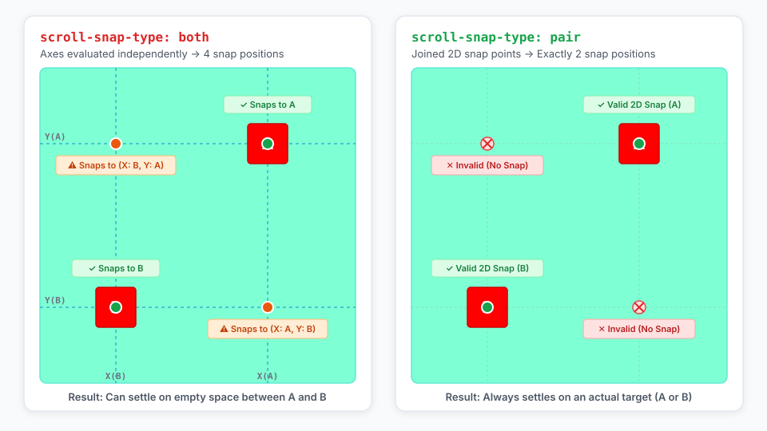

# Explainer: scroll-snap-type: pair

## Introduction

The `scroll-snap-type` property defines how strictly snap points are enforced on a scroll container and along which axes snapping occurs.

This explainer proposes introducing the `pair` keyword to `scroll-snap-type` in [CSS Scroll Snap Module Level 2](https://drafts.csswg.org/css-scroll-snap-2/) (extending [CSS Scroll Snap Module Level 1](https://drafts.csswg.org/css-scroll-snap-1/)). When `pair` is specified, the scroll container performs 2D joined-axis snapping, ensuring that snapping aligns to the same element in both the inline and block dimensions.

## Background and Motivation

In modern web applications, 2D scrolling surfaces—such as interactive maps, node graphs, design canvases, seating charts, and game boards—feature points of interest scattered across a 2D plane. When users pan across these surfaces, authors often want the viewport to settle squarely on a specific point of interest.

Under `scroll-snap-type: both`, the scroll container evaluates snap positions independently along each axis. While this behavior aligns well with orthogonal grids where horizontal and vertical alignments are decoupled (analogous to independent sticky headers in a data grid), it allows the container to snap horizontally to Element A and vertically to Element B. In a scattered point-of-interest layout, snapping to (Element A.x, Element B.y) positions the viewport over empty space between elements.

The `pair` keyword addresses this by coupling both axes during snap candidate evaluation, treating each target area as an atomic 2D coordinate pair.

## Goals

* Enable authors to enforce atomic 2D scroll snapping to a single element across both dimensions without custom JavaScript scroll interception.

## Non-goals

* Altering the existing semantics of `scroll-snap-type: both`, which remains the mechanism for independent dual-axis snapping.
* Introducing custom multi-element grouping or arbitrary subset constraints beyond individual snap areas that declare dual-axis alignment.

## Proposal

### Axis Behavior and Candidate Selection

The `scroll-snap-type` syntax is extended as follows:

```css
scroll-snap-type: [ none | x | y | block | inline | both | pair ] [ mandatory | proximity ]?
```

When `scroll-snap-type` specifies `pair`:

1. **Dual-Axis Alignment Requirement**: A snap area is only considered a valid snap candidate if it defines a snap alignment other than `none` along both the inline and block axes (e.g., `scroll-snap-align: center center` or `scroll-snap-align: start start`). Snap areas specifying alignment on only a single axis (e.g., `scroll-snap-align: start none`) are ignored and do not influence container snap extremes or snap selection.
2. **Joined-Axis Snapping**: The scroller snaps to a single selected element across both the inline and block axes simultaneously.
3. **Single-Axis Gestures**: When scrolling occurs purely along one axis, candidate evaluation along the scrolled axis determines the target, and the cross-axis snap position is derived directly from the selected candidate's alignment.

## Use Case: 2D Interactive Map with Points of Interest ([Demo](https://jsfiddle.net/lcdavid94/vpfcteq1/))

An interactive map scroller displays landmarks positioned across a large 2D surface. When the user pans across the map viewport, the container always aligns both horizontal and vertical axes to the same landmark box, centering the closest landmark in the viewport.



## Compatibility

The addition of the `pair` keyword introduces a new opt-in value for `scroll-snap-type` without modifying default scrolling behavior or altering existing `scroll-snap-type: both` semantics.

* Existing websites utilizing `scroll-snap-type: both` continue evaluating horizontal and vertical snap points independently.
* Containers specifying `scroll-snap-type: pair` in browsers without support will treat the declaration as invalid and fall back per standard CSS cascading rules.
